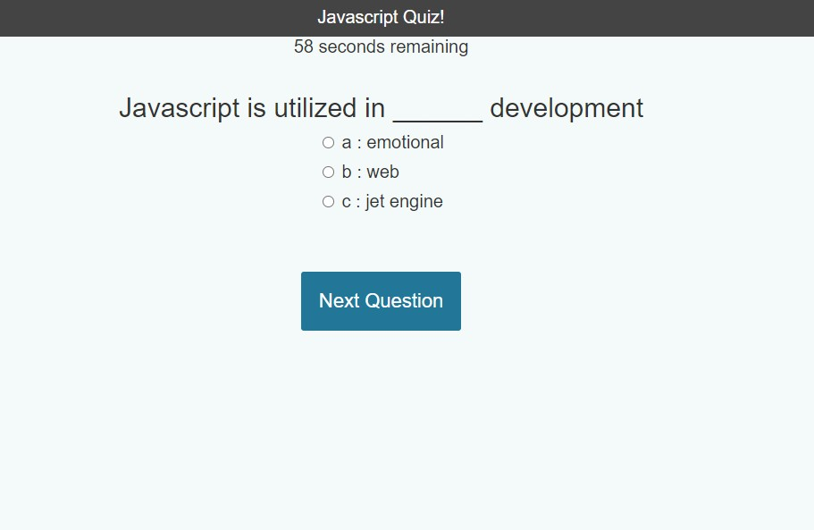
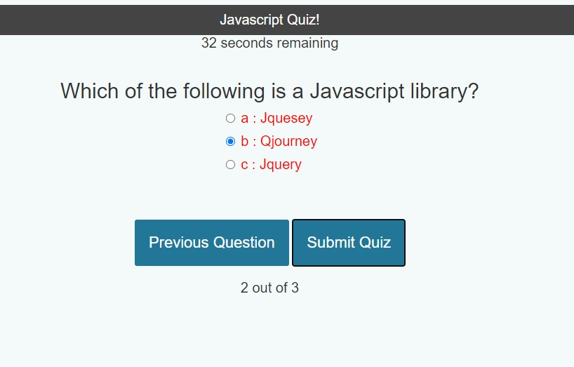
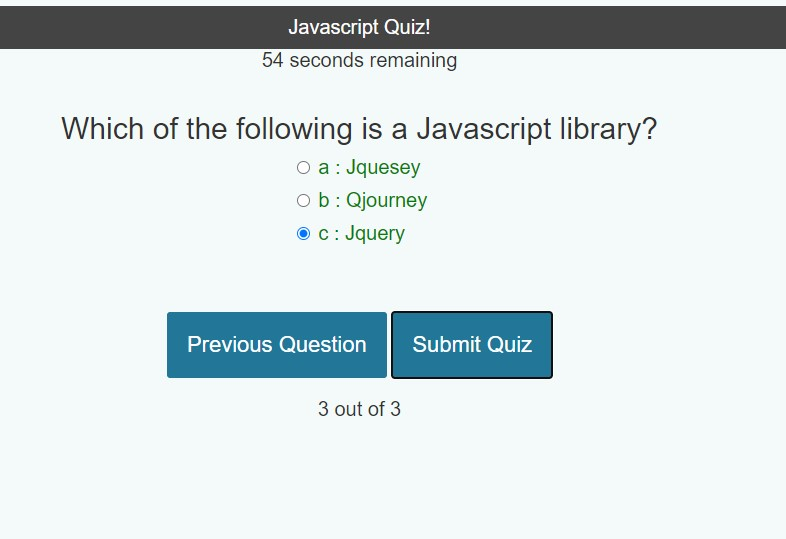
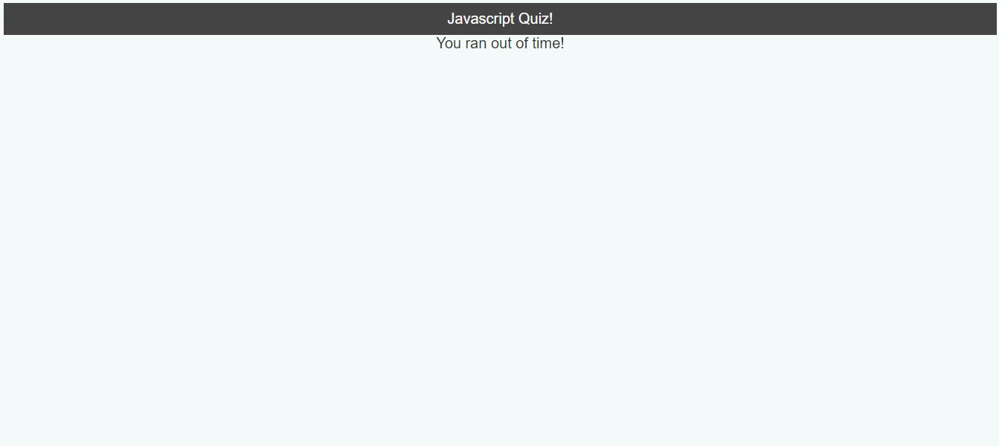

## Javascript Quiz

## Description
Javascript Quiz is a simple 3-question quiz about extremely difficult javascript elements that only a true master would know.

## Installation
Clone this repository and open html (js inline) and css files in code editor. View website at https://mpkahn.github.io/homework04/. Images in assets folder.

## Usage
Open https://mpkahn.github.io/homework04/ And the countdown clock will begin! You have 60 seconds to successfully answer the 3 questions before the quiz goes away and you must try again.

One question will be present at a time. Click one of the 3 available answers and hit "next question" to view the next one. At any point before you submit, you can click "previous question" if you want to return back to the previous one. 

Once you are confident in all your answers, hit "Submit" and you will see how many you got correct displayed at the bottom. Additionally, questions that you got right will be in green and questions you got wrong will be in red. Use the "previous" and "next" buttons to go back through the questions to see. 

## Credits
Most credit goes to this tutorial website that helped me build out the major components of this and then try to figure out my own customization from there: https://www.sitepoint.com/simple-javascript-quiz/

Additionally had to utilize JSX which we haven't learned in class, but was used in that tutorial, so I had to go back and learn some of what that is: https://reactjs.org/docs/introducing-jsx.html

W3schools helped with a lot  of various javascript and CSS elements MOST importantly, the timer: https://www.w3schools.com/js/js_timing.asp

## License
MIT License

Copyright (c) [year] [fullname]

Permission is hereby granted, free of charge, to any person obtaining a copy of this software and associated documentation files (the "Software"), to deal in the Software without restriction, including without limitation the rights to use, copy, modify, merge, publish, distribute, sublicense, and/or sell copies of the Software, and to permit persons to whom the Software is furnished to do so, subject to the following conditions:

The above copyright notice and this permission notice shall be included in all copies or substantial portions of the Software.

THE SOFTWARE IS PROVIDED "AS IS", WITHOUT WARRANTY OF ANY KIND, EXPRESS OR IMPLIED, INCLUDING BUT NOT LIMITED TO THE WARRANTIES OF MERCHANTABILITY, FITNESS FOR A PARTICULAR PURPOSE AND NONINFRINGEMENT. IN NO EVENT SHALL THE AUTHORS OR COPYRIGHT HOLDERS BE LIABLE FOR ANY CLAIM, DAMAGES OR OTHER LIABILITY, WHETHER IN AN ACTION OF CONTRACT, TORT OR OTHERWISE, ARISING FROM, OUT OF OR IN CONNECTION WITH THE SOFTWARE OR THE USE OR OTHER DEALINGS IN THE SOFTWARE.
